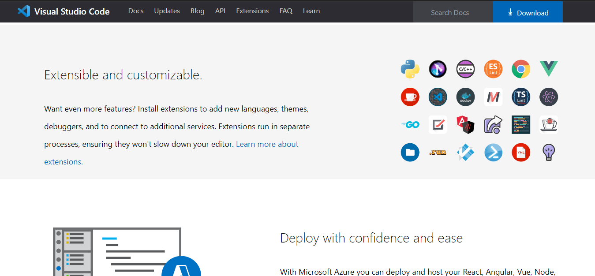
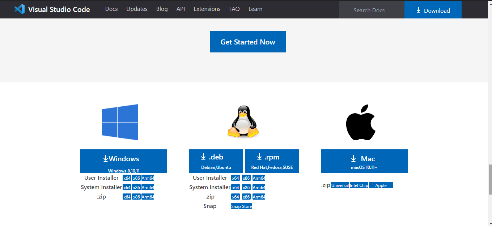

## VsCode replica Project 

### Output1

### Output2

### Output3

### Output4

### Output5

### Output6

### Output7

### Output8

- this is a replica of VsCode just for practice and educational purpose using html and Tailwind.